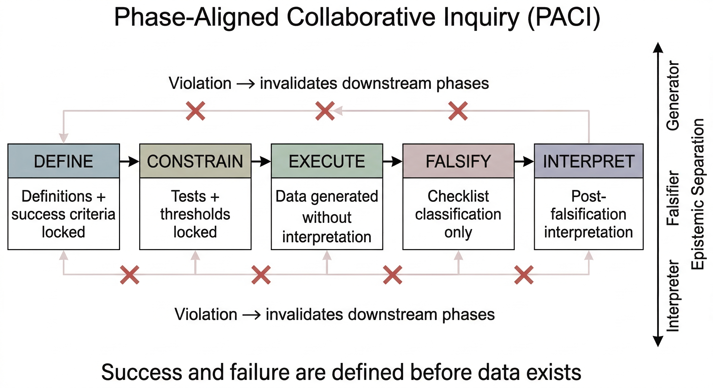

# Phase-Aligned Inquiry

Most collaborative research fails not because the ideas are wrong, but because the structure allows confirmation bias and premature interpretation to corrupt results.

Phase-Aligned Inquiry (PACI) is a protocol designed to prevent that.

## The Problem

Collaborative theoretical research—whether conducted by individual researchers, AI-assisted teams, or multi-agent systems—commonly fails through structural mechanisms rather than intellectual deficits:

* **Confirmation bias at the execution layer:** Measurement and interpretation are performed by the same component, allowing theory to contaminate data collection.
* **Premature interpretation:** Early signals trigger claims of success before systematic falsification is complete.
* **Narrative momentum override:** Compelling preliminary results cause contradictory evidence to be explained away rather than confronted honestly.

These failure modes persist because single-agent or role-conflated systems lack the structural separation necessary to prevent them. Adding more participants or computational resources does not solve the problem—it often amplifies it.

## The Solution: Phase-Aligned Collaborative Inquiry (PACI)

PACI is a research methodology that prevents structural failures through
role separation, sequence enforcement, and pre-commitment to failure criteria.

The PACI workflow separates inquiry into five strictly ordered phases.

*Figure: Phase-Aligned Collaborative Inquiry protocol structure showing
role separation and one-way phase enforcement.*

1.  **Role separation:** Generation, constraint, execution, falsification, and interpretation are performed by functionally distinct components. No single participant both produces and validates results.
2.  **Sequence enforcement:** Each phase must complete before the next begins. Later phases cannot contaminate earlier ones. Violations are detected and corrected immediately.
3.  **Pre-commitment to failure criteria:** Success and failure conditions are defined explicitly before data exists, preventing retroactive redefinition of observables.

PACI does not guarantee correct, fast, or interesting results. It guarantees that when hypotheses fail, they fail cleanly and informatively, with complete documentation of where and why failure occurred.

## The Case Study

This repository demonstrates PACI through a physics case study where a falsifiable hypothesis about emergent spacetime properties was rigorously tested and cleanly falsified.

The protocol prevented premature interpretation, forced invariance testing, and enabled conceptual reclassification when the original claim failed.

The case study exists only to show that PACI works under real epistemic pressure.

The hypothesis failed. The data revealed something unrelated and arguably more interesting. That finding is documented separately in `case-study/07-what-the-wreckage-revealed.md` — not as a claim, but as a note preserved for anyone who finds it useful.

## What This Repository Contains

The protocol is the primary contribution. Everything else in this repository exists to demonstrate, support, or contextualize it.

### `/methodology` — The Core Contribution
* **[PACI Protocol](https://github.com/leenathomas01/phase-aligned-inquiry/blob/main/methodology/01-paci-protocol.md) ← Start here**
* Role architecture details
* Sequence discipline framework
* Usage guidelines and preconditions
* Hard requirements and self-assessment checklist

### `/case-study` — Demonstration
* Complete documentation of the HQG hypothesis lifecycle
* Phase-locked artifacts (Define → Constrain → Execute → Falsify → Interpret)
* Lessons extracted from clean falsification
* `07-what-the-wreckage-revealed.md` — what the failure exposed that was unrelated to the original question

### `/technical` — ⚠️ Planned
> This section is not yet populated. It will contain simulation code, parameter sweep methodology, and data analysis procedures when available. The v1.0 tagged release does not include technical implementation files.

### `/appendix` — ⚠️ Planned
> This section is not yet populated. It will contain fuller conversation transcripts, decision point documentation, and multi-agent process notes when available. The v1.0 tagged release does not include appendix content.

## Quick Start

If you want to use PACI for your own research:
* Read `methodology/01-paci-protocol.md` first. It contains the complete specification, including preconditions, role definitions, and failure patterns.

If you want to understand how PACI was derived:
* Start with `case-study/00-context.md`, then follow the phase documentation sequentially to see how falsification unfolded.

If you're evaluating whether PACI is credible:
* Read Section 5 (Guarantees / Does NOT Guarantee) and Section 4.6 (Observable Failure Patterns) in the protocol. These sections define what PACI can and cannot do.

If you're a skeptic:
* Good. Read `methodology/01-paci-protocol.md` Section 2 (Preconditions). If your research domain or team structure does not meet these hard requirements, PACI will not work for you. The protocol is explicit about its limitations.

If you're curious about what failed and what it revealed:
* Read `case-study/07-what-the-wreckage-revealed.md`. The original hypothesis was falsified. Something else was sitting in the data.

## When To Use PACI

PACI is appropriate when:
* Your hypothesis is falsifiable (makes testable predictions)
* Confirmation bias is a significant risk
* Multiple participants or agents can specialize in different roles
* You can afford sequence discipline over speed
* You are prepared to document and learn from null results

PACI is **not** appropriate for:
* Pure ideation or brainstorming
* Unfalsifiable philosophical questions
* Consensus-building exercises
* Single-agent research without role separation
* Time-critical work requiring rapid iteration

## Status

| Component | Status |
|-----------|--------|
| PACI Protocol (v1.0) | ✅ Complete — stable tagged release |
| Case Study (HQG) | ✅ Complete — all phases documented |
| Wreckage Note | ✅ Complete |
| `/technical` implementation files | ⚠️ Planned — not in v1.0 |
| `/appendix` transcripts & meta-analysis | ⚠️ Planned — not in v1.0 |

The core protocol and case study are stable. Planned sections will be added in future releases without affecting v1.0 integrity.

## Citation

If you use or adapt PACI in your research, please cite:

> Phase-Aligned Collaborative Inquiry (PACI): A Protocol for Falsifiable Multi-Agent Research. (2026). Retrieved from [https://github.com/leenathomas01/phase-aligned-inquiry](https://github.com/leenathomas01/phase-aligned-inquiry)

---

## Related Work

**For a complete catalog of related research:**  
📂 [Research Index](https://github.com/leenathomas01/research-index)

**Thematically related:**
- [PARP](https://github.com/leenathomas01/Power-Asymmetry-Restraint-Protocol-PARP) — Governance under opacity
- [Embodied Agent Governance](https://github.com/leenathomas01/embodied-agent-governance) — External failure knowledge for agents
- [The Continuity Problem](https://github.com/leenathomas01/The-Continuity-Problem) — Why governance must precede autonomy

---

*PACI is not a guarantee of success. It is a guarantee of honesty.*
